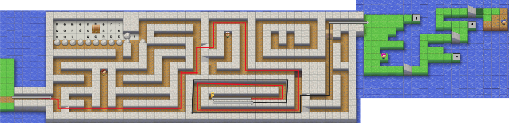

# Level 1

- Use `hjkl` to walk along the line, to get gold key1 and unlock the box 

- In lawn part
    - Move to position labeled as 1, then j to pass the obstacle in last line 
    - Move to position labelled as 2, then k to pass the obstacle above the last line 
    - Move to position labelled as 3, then k to the first line 
- Go to the little people, then press "Esc" 

# Level 2

- Use `hjkl` to walk along **TBWAnd<space>theheoiw** to get `w` key 
- Walk along **wioehe<space>om** then press `wll` to get `e` keyh 
- Press `jl` to collect gold key2

- Keep Pressing `w` until cannot, then press `l` to collect `b` key 
- Press `kkkblll` to collect gold key3
- Enter `kkll`, Press `k` 7 times, `b` 3 times, `e` once, to collect gold key 
- Press `ee` then press `j` 7 times, `e` 4 times to back to **.**
- Use `hjkl` to unlock boxes with 3 gold keys 
- Go to the littel people below, then press "Esc" 

# Level 3

- Use `hjkl` to collect `B` key 
- **While (trulle)** puzzle (30 Seconds)
    - keep pressing `w` or `e` to arrive last line, 
    - press `l` to collect `x` key

- Back to **Roses aren't** puzzle 
    - use `hjkl` and `bwe` to direct to red character, press `x` to delete it 
    - grab the brown key 

- Back to level 1: **Remeber: words** puzzle 
    - on **!** position, press `Bkl` to unlock the box 

- In torch light view
    - go to **S** position, press `e` to back to **!** 
    - Back to place where unlock 3 boxes
    - Press `k` to go down, meet the little people, then `Esc`

# Level 4 
- **Supercalifra** puzzle 
    - Use `x` to delete red letters one by one 
    - Collect `E` and `W` keys 

- **\<script\>** puzzle 
    - start from `<`
    - `We` to get `r` key 
    - `WEh`  → `r0`
    -  `Wl` → `r<`
    - `WWl` → `rl`
    - `WWW` → press `l` 5 times → `rm`
    - `WW` → `ra` 
    - press`l` 3 times → `rr`
    - press `E` 5 times → press `l` 5 times → `rr`
    - Go back to the little man just appeared, then press `Esc`

# Level 5 
- **Deleting** puzzle 
    - Start from **D**
    - `ww`  → `x` → `e` → `x`
    - `jjj` → `bb` → `lll` → `x`
    - `j` → `bb` → `rd` → `l` → `xxx` → `wwwl` → `xxx`
    - `j` → `rr` → `h` → `x`
    - `jw` → `x` → `rw`
    - `j` → `rs` → `l` → `rn` → `bbb` → `rm`
    - Collect `d` key 

- **Before you** puzzle 
    - Start **e** in last letter of **gone**
    - `h` → `de` → `bb` → `dw`
    - `blj` → `de` → `ww` → `ra` → `l` → `rw` → `e` → `x`
    - `j` → `rx`
    - `jbb` → `rs`
    - `je` → `x` → press `l` 5 times → `de`
    - `j` → press `h`3 times → `x` → `ww` → `x` → `rd` → press `b` 4 times  → `e` → `x`
    - `wwwj` → `rl`
    - `jbb` → `dw`

- **These are** puzzle
    - Start from **e** in first e letter of **These**
    - `ww` → `dwdw`
    - `jww` → `dw`
    - `jbb` → `dw` →`B` → `dW`
    - `j` → `wl` → `x` → `ry` → `w` → `dw` → `wE` → `x`
    - `jjllll` → `db` → `BBBh` → `x` → `bh` → `x`
    - `jwe` → `dE` → `WW` → `rn`
    - `jjbbe` → `re` → `ww` → `x`
    - `jjjwlll` → `de`
    - `jh` → `rh` → `bbhhhh` → `de` 
    - `kbb` → `rt` → `e` → `x`
    - press j 4 times → `dj`
    - Move on the "X" in the bottom left corner by ressing `j` and then do the command "dw"
    - Collect the gold key ghhh

# Level 6 

- **Some texts** puzzle: 8 keys
    - From **m** in **Some**, use `j` to move to end line and leave block
    - Press `k` to re-enter the block to letter **c** in **Back** 
    - Press `b` 3 times, then `dw`
    - Get the key 

- **~ is** puzzle: 10 keys 
    - Go into **h** in **hear**, press `rh` → `e` → `rt`
    - `jw` → `rf` 
    - Get `~` key 

- **Begin** puzzle: 15 keys 
    - From **B** in Begin `~` → `ee` → `x` 
    - `jjb` → `x` → `WWl` → `rt` → `ex`
    - Get `$` key

- Go up to **Shaken** puzzle
    - From **u** in understand, `~` 

- **Go up to There** puzzle: 13 keys 
    - From **u** in understand, `~` → `$` → `hh` → `D`  
    - `$` → `kkk` → `rs`
    - Get `G` key

- **With** puzzle: 16 keys
    - From **W** in **With**, `$` → `~` → `w` → `r0` → `j` → `$x` → `ww` → `r1` → `w~`
    - Collect `^` key

- **function** puzzle: 24 keys 
    - Go to first space of line **Hello! What's up?** 
    - `ElD` → `jjj^` → `dB` → `jdd`
    - `ww` → `x` → `jwwl` → `rI`
    - `Wl` → `D`

- **I doesn't** puzzle
    - `bBll` → `xx` → `Ejll` → `de` → `jh` → `x` → `bh` → `x` → `wll` → `xx`      
    - Collect golden key 
    - Lock the 2 boxes and go into Level 7 

# Level 7 
- **The cat Block** puzzle
    - Go into every grass to collect all keys: `f`, `,`, `;`, `F`, `T`, `t`, `z`

- **emptyStr** puzzle: 5 keys 
    - `t;` → `dT"`
    - Collect golden key
    
- Use the gold key to open the door and collect `%`

- **if (practise) Block** puzzle: 5 keys 
    - From **i** in **if**, `$` → `%` → `jd%`
    - Collect the golden key

- Go back to the start of level 7 block: The cat, to unlock the door
    - Collect `g` key

- **fx Block** puzzle: 12 keys 
    - Press `fx` before joining the block 
    - Press `j` to arrive **d** in **find**
    - `,x` → `j;x` → `j,x` → `jx` → `;x`
    - `j` → `x` → `jj` → `Ti` → `x` → `j` → `x` → `ta` → `x`

- **What's in** puzzle
    - Before enter; press `Fa`
    - `gg` → `$` → `;k` 

- **(2-(3** puzzle
    - Go into **-** in **-2*4** part 
    - `%k` to unlock the door and open the level 8 
    - How to turn back!! 
        - Press `t-` before enter then `;k` to exit the **(2-(3** puzzle 
        - Enter the **a** in **name** in **What's** puzzle : `Gh` to exit 

